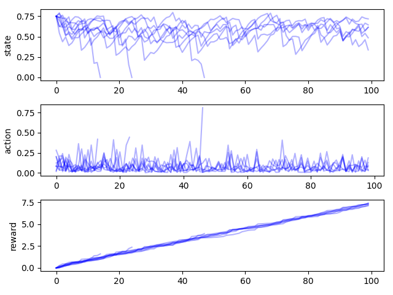

```{r setup, include=FALSE}
knitr::opts_chunk$set(#dev.args=list(bg="transparent"), 
                      echo = FALSE, 
                      message=FALSE, 
                      warning=FALSE,
                      fig.width=11, 
                      fig.height=6.5, 
                      cache = TRUE)

library(tidyverse)
library(ggthemes)
library(magick)
theme_set(theme_solarized(base_size=16))
scale_colour_discrete <- function(...) scale_colour_solarized()
scale_fill_discrete <- function(...) scale_fill_solarized()
pal <- solarized_pal()(6)

txtcolor <- "#586e75"


library(patchwork)
ggimage <- function(path, transparent = FALSE){
  img <- magick::image_read(path)
  if(transparent)  img <- magick::image_transparent(img, "white")
  ggplot2::ggplot() + 
  ggplot2::annotation_raster(img, 
                    xmin=-Inf, xmax=Inf, ymin=-Inf, ymax=Inf) +
    theme(axis.line = element_blank(), 
          panel.background = element_blank(),
          axis.ticks = element_blank(), 
          axis.text = element_blank(), 
          axis.title = element_blank())
  
}

ggblank <- function() ggplot() + geom_blank() + 
  theme(axis.line = element_blank(), panel.background = element_blank())

```

layout: true
background-color: #fdf6e3
class: center, top

---

# Computing for Sustainability: Immense Challenges Meet Great Opportunity

<div class="my-footer">

<a href="https://carlboettiger.info"> `r icon::fa("user")` Carl Boettiger</a> | 
<a href="https://berkeley.edu"> `r icon::fa("briefcase")` UC Berkeley</a> | 
<a href="https://twitter.com/cboettig"> `r icon::fa("twitter")` @cboettig</a>

</div>


---

layout: false
background-image: url(../image-library/noaa/noaa-ice-cc0.jpg)
background-position: center
background-size: 100%
class: center, top, inverse


---

layout: false
background-image: url(../image-library/royalsociety/methane_bubbles.jpg)
background-position: center
background-size: 100%
class: center, top, inverse


---

layout: false
background-image: url(../image-library/royalsociety/forest-fire.jpg)
background-position: center
background-size: 100%
class: center, top, inverse

---

layout: false
background-image: url(../image-library/noaa/noaa_tuna_net.jpg)
background-position: center
background-size: 100%
class: center, top, inverse

---

layout: true
background-color: #fdf6e3
class: center, top

---


[Overpeck+ (2011) doi:10.1126/science.1197869](https://doi.org/10.1126/science.1197869)


---

# Rebuilding Global Fish Stocks?


[Worm+ (2006) doi:10.1126/science.1132294](https://doi.org/10.1126//science.1132294)

---


[Barnoksy+ (2012) doi:10.1038/nature11018](https://doi.org/10.1038/nature11018)


---


[Overpeck+ (2011) doi:10.1126/science.1197869](https://doi.org/10.1126/science.1197869)

---


[credit: Hopkin (2006) doi:10.1038/444420a](https://doi.org/10.1038/444420a)

---


[credit: Witze (2013) doi:10.1038/501480a](https://doi.org/10.1038/501480a)

---


---


[Evans+ doi:10.1126/science.1201765](https://doi.org/10.1126/science.1201765)

---


[Mitchner (2012) doi:10.1016/j.tree.2011.11.016](https://doi.org/10.1016/j.tree.2011.11.016)

---

# Image Recognition 

## (Microsoft AI for Earth)


---

## Global Fishing Watch


---

# From Data to Decisions...

---

## Understand

--

## Predict

--

## Decide


---

# Forecasting

- Can we improve our predictions?

--

- Capture Uncertainty

--

- Describe the limits to prediction?

---

# NEON Forecasting Challenge


---

# Register now and enter your predictions!

<https://ecoforecast.org/efi-rcn-forecast-challenges/>

---

# Limits to Forecasting


---

# Conservation Decisions

--

> _We know what to do.  We just have to do it._

---

# But how?

---

## Knowing the objective is not the same as knowing the solution

--

## ecosystems are complex to understand and manage

---

## Like a game of chess


---

## Blindfolded...


---

## In (at least) three dimensions...


---

## With unexpected extreme events...


---


---

### Deep RL methods have been successful in robotics...

 

---

### ... and arcade games ...


---


### <https://gym.openai.com/envs>

---
class: center, middle

## _We're not here to play games... we have a real world to save!_

---
<https://boettiger-lab.github.io/conservation-gym>


---


---


<https://www.alexirpan.com/2018/02/14/rl-hard.html>

---

## Sustainable fisheries management


---

### Example: SAC agent on `gym_fishing-v1`


---

### Optimal solution (given the model)


---


# AI Ethics & Power


---


# An open-source model for science?


---

# Learn more

## ESPM-157: Data Science For Global Change Ecology


---

# Spring 2021

## ESPM 288: Reproducible & Collaborative Data Science

## NEON Forecasting Challenge


---

# Thanks!


<https://carlboettiger.info>

